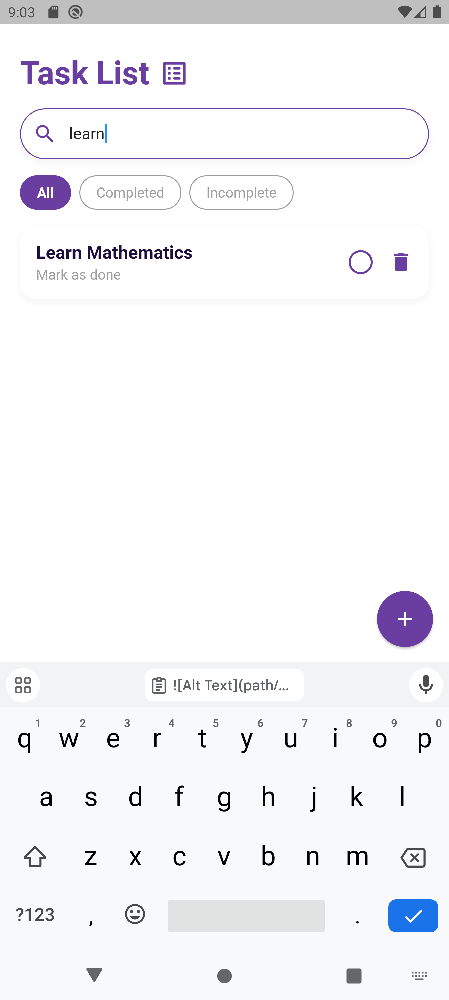

# Task Management App

Aplikasi manajemen tugas sederhana menggunakan Flutter. Aplikasi ini dapat menampilkan daftar tugas, menambahkan tugas baru, mengedit tugas yang ada, dan menghapus tugas. Semua data tugas harus disimpan dan diambil melalui REST API.

## Cara Menjalankan

1. **Extract Zip File & Buka Project**  
   Extract file yang telah diunduh. Setelah itu, buka folder project menggunakan VSCode.

2. **Install Dependensi Flutter**  
   Jalankan perintah `flutter pub get` di terminal atau buka file `pubspec.yaml` dan klik "Get Packages" untuk menginstal semua dependensi yang diperlukan.

3. **Install Dependensi Project API**  
   Arahkan terminal ke direktori `task-management-api` dengan perintah `cd task-management-api`. Kemudian, jalankan `npm install` untuk menginstal semua dependensi yang dibutuhkan untuk API.

4. **Jalankan API**  
   Di terminal, masih dalam direktori `task-management-api`, jalankan perintah `npm start` untuk memulai server API.

5. **Jalankan Aplikasi Flutter**  
   Kembali ke direktori root project dengan perintah `cd ..`. Kemudian, jalankan perintah `flutter run` di terminal atau pilih opsi "Run" dari file `main.dart` di VSCode untuk menjalankan aplikasi Flutter.

## Fitur dan Penggunaan

| Screenshot | Keterangan |
|------------|------------|
|  | Tampilan utama aplikasi yang menampilkan daftar tugas yang ada. |
|  | Formulir untuk menambahkan tugas baru. Pengguna dapat memasukkan judul dan deskripsi tugas. |
|  | Tampilan utama setelah tugas baru berhasil ditambahkan. Tugas baru muncul dalam daftar tugas. |
|  | Tampilan ketika daftar tugas difilter untuk hanya menampilkan tugas yang telah diselesaikan. |
|  | Tampilan ketika daftar tugas difilter untuk hanya menampilkan tugas yang belum diselesaikan. |
|  | Fitur pencarian yang memungkinkan pengguna mencari tugas tertentu berdasarkan kata kunci. |
|  | Formulir untuk mengedit tugas yang ada. Pengguna dapat memperbarui judul dan status tugas. |
|  | Konfirmasi penghapusan tugas yang menanyakan apakah pengguna yakin ingin menghapus tugas. |
|  | Tampilan setelah tugas berhasil dihapus dari daftar tugas. |

